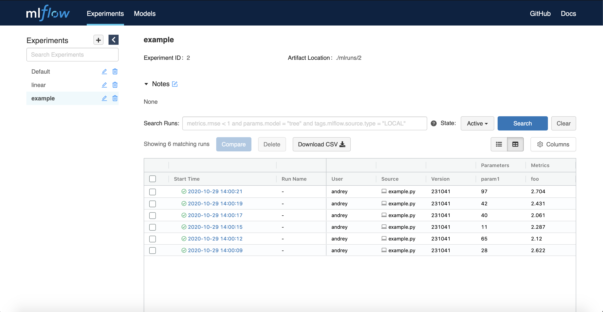
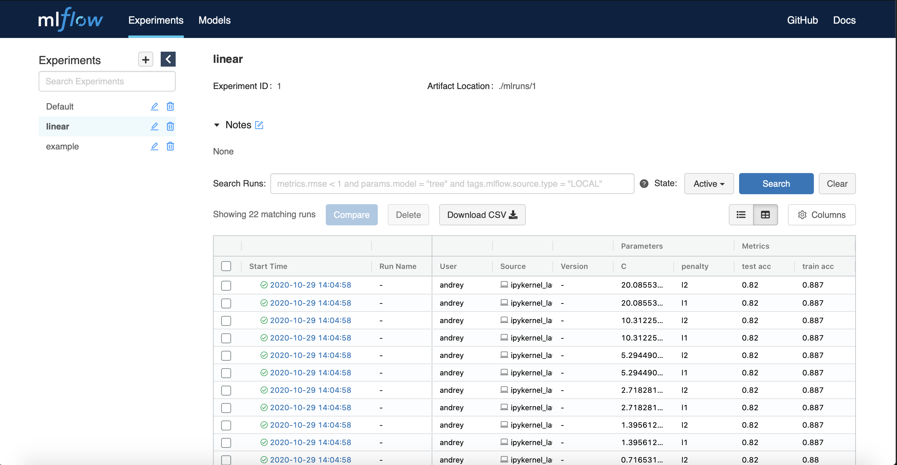

######
MLflow
######

Open Source утилита для работы с экспериментами в машинном обучении. Имеет удобный UI для отслеживания моделей.

Instalation
===========
Подробная инструкция доступна на `сайте <https://www.mlflow.org/docs/latest/quickstart.html>`_.

Устанавка из PyPi:

.. code-block:: bash

  pip install mlflow

Примеры
=======

Для запука сначала рекомендуется запустить сервер UI. Подробно об этом можно прочитать на `сайте <https://www.mlflow.org/docs/latest/quickstart.html#logging-to-a-remote-tracking-server>`_.

Для нашего эксперимента достаточно простого запуска:

.. code-block:: bash

  mlflow ui

После чего сервер будет доступен по `адресу <http://localhost:5000>`_.

QuickStart
----------

Немного модифицированный пример из официального `сайта <https://mlflow.org/docs/latest/quickstart.html>`_. Для простоты убрал `artifacts`, так как для них нужно создавать отдельный сторадж, который доступен клиенту и серверу. Код доступен по `ссылке <quickstart/example.py>`_.

Запуск эксперимента запукается следующим образом:

.. code-block:: bash

  python3.6 quickstart/example.py
  
После запуска данные обновятся на сервере, и вся информация будет доступна в запущеном UI.

LinearModel
-----------

Рассмотрим простой пример для запуска эксперимента с разными параметрами. В качестве базово примера рассмотрена задача подбора гиперапараметров модели логистической регресии. Код доступен по `ссылке <linear/linear.py>`_.

Запуск эксперимента запукается следующим образом:

.. code-block:: bash

  python3.6 linear/linear.py --C <параметр регуляризации> --penalty <тип регуляризации>
  
После запуска на сервере будет доступна информация о данном эксперименте.

Для удобства все можно реализовывать в ``jupyter notebook`` для этого откройте `файл <linear/linear.ipynb>`_. В котором реализован подбор гиперпараметров по сетке.

